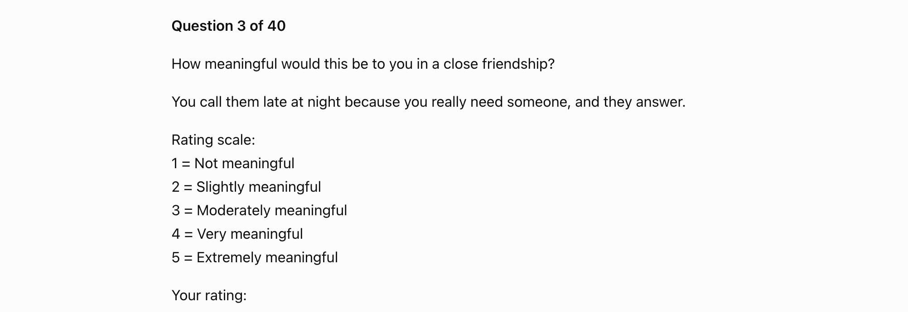
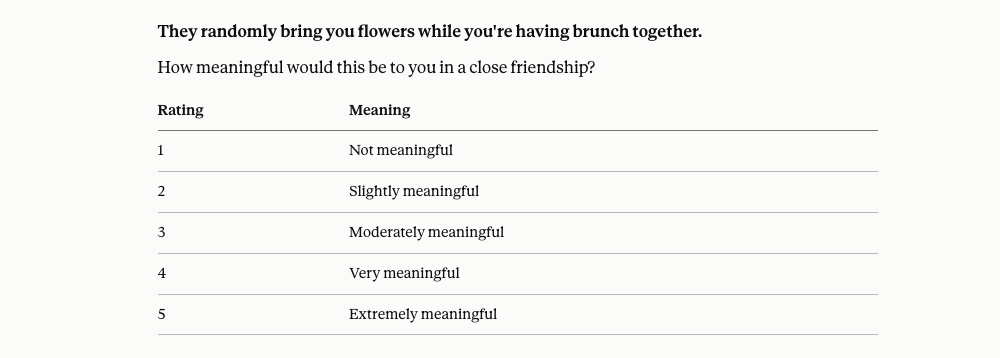
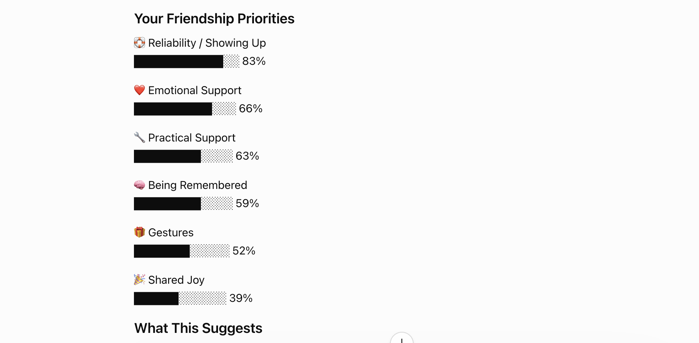

# Friendship Language

### A scenario-based questionnaire for understanding friendship preferences

A friendship-preference questionnaire that explores the dynamics that make close friendships feel meaningful. It collects 1–5 ratings for 40 scenarios, calculates deterministic category scores, and presents a ranked, human-readable summary.

Tested with multiple LLMs.

## Usage Options

This skill supports two execution modes.

### Option 1: Agent Mode (recommended)

Requires:
- An AI agent environment that supports loading skills
- Access to the repository files
- Options to run the questionnaire in `full`(40 scenarios, default) or `short`(25 scenarios) variants.

The skill uses:
- `data/scenarios*.json` as the questionnaire source
- `src/questionnaire.py` for question selection and progress tracking
- `src/calculator.py` for deterministic scoring

The LLM handles conversation flow and result interpretation.

### Option 2: Prompt Mode

No installation required.

Use the v1 prompt in:

`archive/friendship-language-v1.md`

Copy the prompt into an LLM chat and follow the questionnaire directly.

This version keeps all logic inside the prompt and is intended for easy sharing and experimentation.

## Result Categories

- Shared Joy
- Reliability / Showing Up
- Emotional Support
- Practical Support
- Being Remembered
- Gestures

## Why I Built This

This project was inspired by the idea of love languages, but applied to friendship.

I've noticed that some friendship conflicts aren't caused by a lack of care—they're caused by different expectations of what "caring" looks like. I've seen friends drift apart because one person felt the other didn't care enough, while the other genuinely believed they had been showing up in meaningful ways.

I also came across discussions online where people described similar misunderstandings in friendships: one friend might value emotional conversations, another appreciates practical help, while someone else feels most cared for when people remember small details or create shared experiences together.

That made me wonder whether people have different "friendship priorities" in much the same way they may have different love languages.

This questionnaire is an attempt to explore that idea through concrete scenarios rather than abstract statements. The goal isn't to diagnose personalities or define what a "good" friendship looks like. Instead, it's designed to help people reflect on which kinds of actions make them feel genuinely valued—and perhaps spark conversations that help friends understand one another better.

## Design Principles

- Scenario-based rather than trait-based questions
- Supports weighted, multi-category scenarios
- Normalized scoring to account for different category sizes
- Measures friendship preferences rather than personality
- Lower scores reflect relative priority, not absence of appreciation

## Example Output

### Questionnaire

ChatGPT:



Claude:



### Results



## Project structure

```text
friendship-language/
├── README.md
├── SKILL.md
├── AGENTS.md
├── data/
│   └── scenarios.json
│   └── scenarios_short.json
├── src/
│   ├── questionnaire.py
│   └── calculator.py
│   └── categories.py
│   └── scenarios.py
├── templates/
│   ├── en_US/
│   │   ├── question_format.md
│   │   ├── sample_opening.md
│   │   └── sample_output.md
│   └── zh_CN/
│       ├── question_format.md
│       ├── sample_opening.md
│       └── sample_output.md
├── tests/
│   ├── test_questionnaire.py
│   └── test_calculator.py
│   └── test_categories.py
│   └── test_scenarios.py
└── archive/
    └── friendship-language-v1.md
```

`data/scenarios*.json` is the source of truth for the questionnaire. The Python modules implement question selection and score calculation.

## Roadmap

- [x] Prompt-based prototype
- [x] Python questionnaire engine
- [x] JSON scenario dataset
- [x] Unit tests
- [x] LLM skill integration
- [ ] Web UI (maybe)

## Credits

Designed and implemented by **Cherie Leng (Cold)**.

This includes the questionnaire concept, scenario design, weighting methodology, scoring system, and implementation.

___

© 2026 Cherie Leng. All rights reserved.